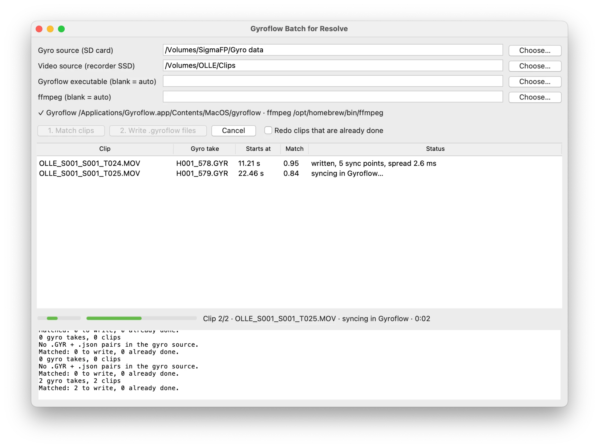

# Gyroflow Batch Resolve

Batch your clips to Gyroflow: match each clip to its gyro log, sync it, and write a `.gyroflow` project file beside it, ready for the Gyroflow plugin in any video editor that supports it (DaVinci Resolve, Final Cut Pro, Premiere Pro, After Effects and other OpenFX hosts). No setting up clip by clip, and no video is rendered.

> Tested so far only with a SIGMA fp running [fpSup Gyro Base + HDMI](https://github.com/unremarkablegarden/fpSup/tree/gyro-hdmi), an Atomos Ninja V and DaVinci Resolve.



The `.gyroflow` files are ordinary Gyroflow projects with the gyro data embedded: they need no other file and also open in the Gyroflow app.

## What you need

- A SIGMA fp (firmware 5.02) running [fpSup Gyro Base + HDMI](https://github.com/unremarkablegarden/fpSup/tree/gyro-hdmi). It writes a gyro log and lens profile (`H001_577.GYR` + `.json`) for every take recorded to the Ninja.
- [Gyroflow](https://github.com/gyroflow/gyroflow/releases) 1.6.3 or newer, the GitHub build. The Mac App Store build is sandboxed and its command line cannot read clips.
- The Gyroflow plugin for your editor, installed from Gyroflow (Video editor plugins).
- ffmpeg and ffprobe 8.0 or newer (the first with a ProRes RAW decoder). macOS: `brew install ffmpeg`.

There is no packaged release yet: build the app as described under [Build](#build). It has been used on macOS; the build also runs on Windows and Linux.

### CinemaDNG recorded in the camera

Clips recorded internally with the gcsv edition of fpSup Gyro need no recorder and no matching: each clip folder (`A001_461/`) already holds its frames, `A001_461.gcsv` and `A001_461.json`. Point both folder fields (or the video folder and `--gyro`) at the card or at a copy of it; every such folder is listed as one clip, named by its frame pattern (`A001_461_20260928_%06d.DNG`), and gets `A001_461_20260928_%06d.gyroflow` beside the frames, the name the Gyroflow app gives a sequence. ffmpeg is not used for these clips.

Tested with one 3464x2308 24p clip from a SIGMA fp and Gyroflow 1.6.3 on macOS.

## Shooting

- Set the fp's timecode to **Free Run**. Each clip is then placed in its log by timecode: exact to a frame, and no camera motion needed. With Rec Run the tool falls back to matching by motion.
- Start and stop takes with REC or the shutter button on the fp, so each take gets its own log and lens profile. A take started from the Ninja's screen is still found, inside whichever log was running.
- Gyroflow's autosync needs some camera motion. A locked-off tripod shot has nothing to stabilise anyway.

## Use

### App

Run **Gyroflow Batch Resolve**.

1. Gyro source: the SD card, or its `gyro_data` folder (or a copy of the `.GYR` and `.json` files).
2. Video source: the Ninja SSD (or the folder you copied the clips to). Subfolders are searched too; untick **Include subfolders** to read only the clips in that folder. Clips in a subfolder are listed with their path.
3. **1. Match clips**: reads each clip and finds its place in the gyro logs. **Refresh** next to either folder does the same after you swap a card or add clips. The Length column shows the clip duration and Timecode its start timecode. The Match column shows `TC` for a clip placed by timecode, otherwise a correlation from 0 to 1; below 0.5 the clip is left out.
4. Optional: select clips and press **Remove from list** (or Delete) to leave them out of the run, or **Clear list** to remove all. The files are not touched.
5. **2. Write .gyroflow files**: runs Gyroflow for each matched clip. The Status column shows the sync points and their spread. A spread of a few ms is a good sync; hundreds of ms means it did not lock.

Re-running on the same card only does the new clips: a clip whose `.gyroflow` already holds sync points is marked "already done" without being read (tick "Redo clips that are already done" to redo them). A `.gyroflow` without sync points, left by an interrupted run, is redone. Clips no log can be found for are skipped, not failed.

Folders can be dragged onto the path fields. Folder and tool paths are remembered in `~/.gyroflow-batch-resolve.json`.

While it works, the small bar at the bottom keeps moving and the status line shows the clip, the step and a running timer, so a stalled run is visible. Cancel stops the running ffmpeg or Gyroflow process; clips that were not reached keep their state and can be written in a later run.

What can go wrong, and what it looks like:

| Problem | Shown as |
|---|---|
| Gyroflow or ffmpeg missing, the App Store Gyroflow, or an ffmpeg without ProRes RAW | ✗ line under the path fields, at startup |
| A clip cannot be read (unsupported file, drive ejected) | that clip `failed: …` in red; the run continues |
| Gyroflow fails on a clip | `failed: …` with the path of its full output under `~/.gyroflow-batch-resolve/logs/` |
| Gyroflow hangs | stopped after 15 min, `failed: … did not finish` |
| Autosync did not lock (fewer than 2 sync points, or spread over 50 ms) | `written, check sync: …` in orange; open that clip in Gyroflow and sync by hand |

### Command line

```bash
gyroflow-batch /Volumes/NINJA --gyro /Volumes/SigmaFP --dry-run
gyroflow-batch /Volumes/NINJA --gyro /Volumes/SigmaFP
```

Same skipping rules as the app. `--force` redoes clips that are already done. `--no-subfolders` reads only the clips in the video folder itself. `--gyroflow`, `--ffmpeg` and `--ffprobe` set tool paths when they are not found on their own.

## In DaVinci Resolve

In other editors, load `<clip>.gyroflow` into the Gyroflow plugin as that editor's plugin documentation describes.

The plugin reads the file path of the clip it sits on and loads `<clip name>.gyroflow` from the same folder. Every copy of the effect does this for its own clip, so the effect is set up once and pasted onto the rest.

1. Import the clips from where the `.gyroflow` files were written, and put them on a timeline. Do not move or rename the clips or the `.gyroflow` files afterwards.
2. Edit page → Effects → search "Gyroflow" → drag the effect onto the first clip. Check that it stabilises: the Inspector's Gyroflow panel shows the project file with that clip's name.
3. Select that clip, copy it (⌘C / Ctrl+C).
4. Select all the other clips → Paste Attributes (⌥V / Alt+V) → tick **Plugins** → Apply.
5. Spot-check a few clips: each should show its own `.gyroflow` in the Inspector.

If a clip does not pick up its file: in the Inspector's Gyroflow panel, press **Load for current file** (Resolve Studio only), or use the Browse button next to Project file and pick `<clip name>.gyroflow`.

Compound clips do not expose a file path to the plugin, so apply the effect before making compound clips, or inside them.

Stabilisation settings (smoothness, zoom, horizon lock) can be changed per clip in the Inspector after this, as usual.

## How it works

- `.GYR` → `.gcsv`: a port of the fpSup web converter, accelerometer included for horizon lock.
- Matching by timecode: the camera writes its running timecode into each log's `.json`, and the Ninja stamps the same timecode on the clip, so the clip's place in the log is the difference. Used when exactly one log holds the clip; nothing is decoded, and autosync then searches only ±0.25 s around it.
- Matching by motion, for everything else: the clip is decoded small and its frame-to-frame change is cross-correlated with the gyro's angular rate over every position in every log.
- CinemaDNG clips: the frame rate and size come from the clip's `.json`, since an image sequence carries none that Gyroflow reads (it assumes 25 fps). Gyroflow's command line opens a sequence only from a project file, so the tool writes a temporary one with the frame pattern, the rate, the log and the lens profile, and Gyroflow syncs and exports from it. Gyroflow also wants a file with the pattern's literal name to exist, so an empty `…_%06d.DNG` is in the clip folder while Gyroflow runs and is removed afterwards.
- Lens profile: the camera's profile for each take, with that take's focal length. The tool sets the dimensions and frame rate from the clip and puts the principal point at its centre. The rolling-shutter readout (`frame_readout_time`) is kept as the camera wrote it; it is not yet verified for HDMI RAW.
- Gyroflow reads autosync settings from the lens profile, not from the command line's `-s`, so they are written into the profile.

## Build

```bash
uv venv --python 3.12 --managed-python .venv
uv pip install --python .venv/bin/python -e ".[dev]"
.venv/bin/pytest -q
.venv/bin/python packaging/build.py   # dist/: the app and the gyroflow-batch binary
```

PyInstaller builds for the platform it runs on. `.github/workflows/build.yml` builds macOS, Windows and Linux on a `v*` tag or by hand from the Actions tab.
